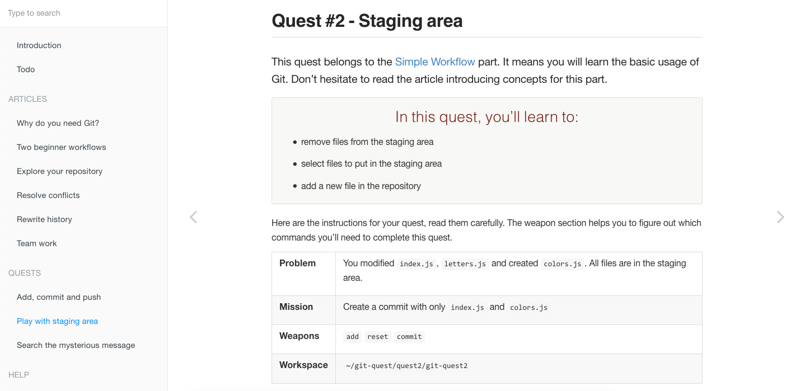

# git-quest

> Determine whether a moving axis-aligned bounding box (AABB) collides with
> other AABBs.

### Zero setup git practice

Tired of fighting with git everyday? 
`Git-Quest` allows you to practice with real world use-cases.
No need to setup a repository, the command-line tool can do it for you. It comes along with a [website](https://jbardon.github.io/git-quest) full of quests.

[Features](#features) | [Installation](#installation) | [Usage](#usage)



## Features
* Automatic environment setup
* Many quests for any level
* Detailed step by step help

Give it a try, look at the [first quest](https://jbardon.github.io/git-quest/quests/quest1/quest1.main.html)  and complete it

## How can I help?

1. Create new quests
2. Open issues on broken quests
3. Fix open issues by sending PRs

## Installation

With [npm](https://npmjs.org/) installed, run

```
$ npm install git-quest
```

## Usage

```bash
$ git-quest  
Usage: git-quest [options] [command]

Options:
  -V, --version       output the version number
  -h, --help          output usage information

Commands:
  list                List available quests
  init <quest> [dir]  Begin a new quest
  read [options]      Read current quest instructions
  help [options]      Show current quest help   
```

#### `init <quest> [dir]`

Creates the directory containing the given quest sources. **Caution: resets any existing directory for this quest**.

- `quest` - Quest id (see `list`).
- `dir` - Location where the quest directory should be initialized.  
Defaults to the current directory.

#### `list`

Display the list of available quests with their id (used in `init`).  
Also available on the [website](https://jbardon.github.io/git-quest).

#### `read [options]`

Opens the current quest instructions in the browser based on current directory.

Options:  
*  `-q`, `--quest` - Quest id

#### `help [options]`

Opens the current quest help in the browser based on current directory.

Options:  
*  `-q`, `--quest` - Quest id

## License

MIT -> Free de tout
GPL -> Oblige de mettre au mins GPL pour les autres
BSD -> A l'air pas trop mal
Apache